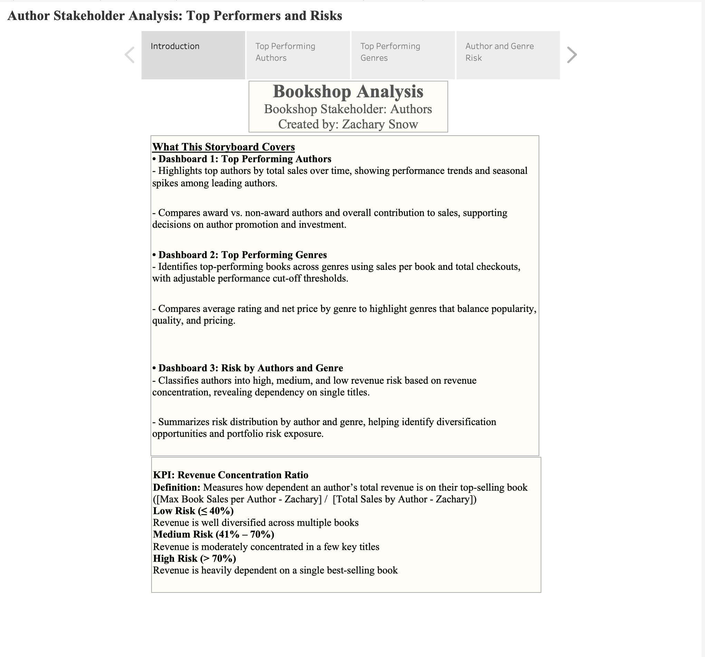
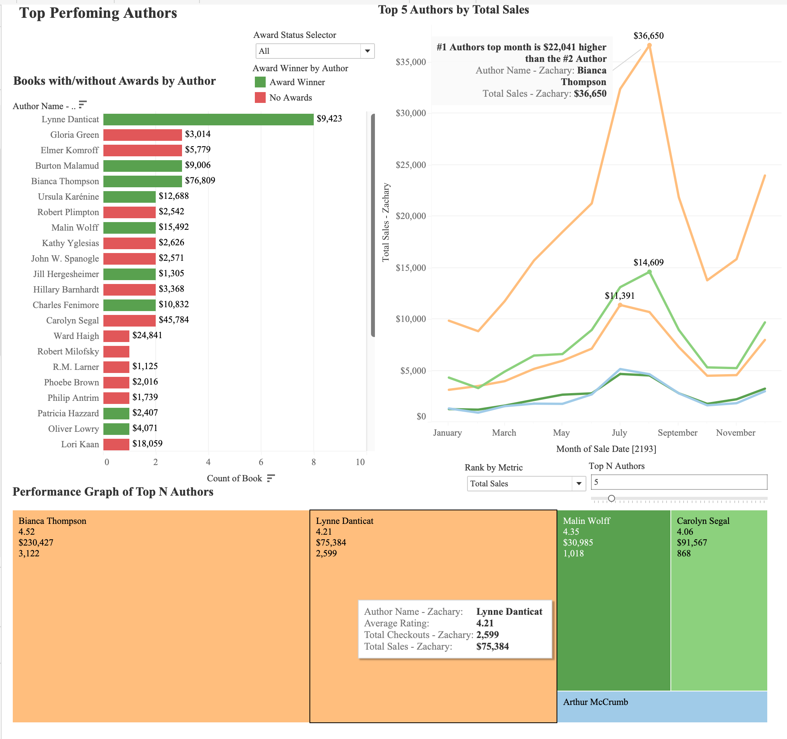
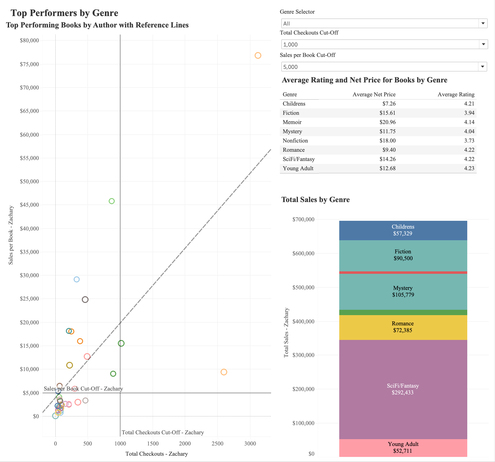
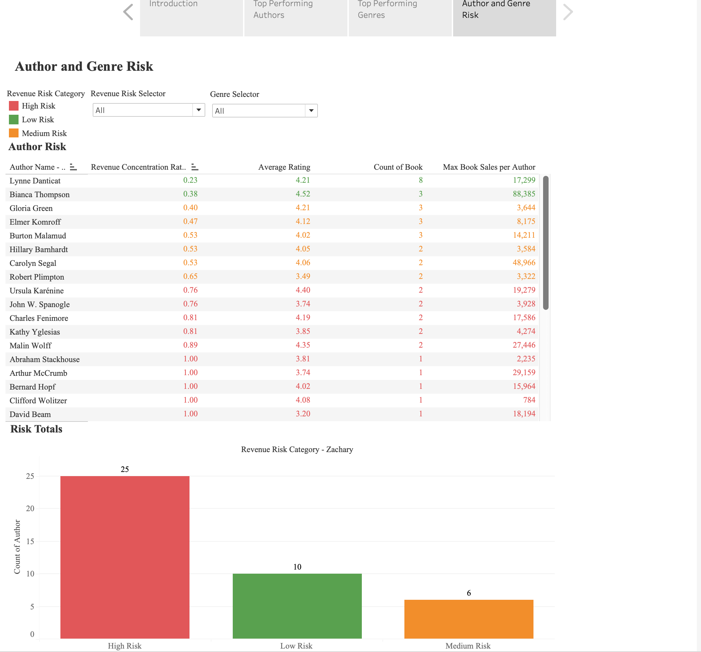

# Bookshop-Portfolio-Risk-Analysis
Built an end-to-end Tableau storyboard to analyze author performance, genre trends, and revenue risk, helping a bookshop optimize inventory and marketing strategy.

---

## 📊 Dashboard Overview

This project delivers a stakeholder-focused analysis of:
- Top-performing authors  
- Genre-level revenue trends  
- Portfolio risk based on revenue concentration  

---

## 📈 Top Performing Authors

- Identified leading authors by total sales  
- Compared award vs. non-award authors  
- Visualized seasonal performance trends  

---

## 📚 Genre Performance Analysis

- Analyzed revenue by genre  
- Compared average rating vs. pricing  
- Identified high-revenue categories (e.g., Sci-Fi/Fantasy)

---

## ⚠️ Risk Analysis

- Developed a **Revenue Concentration Ratio**  
- Segmented authors into:
  - Low Risk (<40%)  
  - Medium Risk (41–70%)  
  - High Risk (>70%)  
- Found 25 authors heavily dependent on a single title  

---

## 🧠 Key Insight

Many top-performing authors are also high-risk due to reliance on a single best-selling book.  
This highlights the need for **portfolio diversification and targeted marketing**.

---

## 🛠️ Tools & Techniques

- Tableau (Storyboards, Parameters, Calculated Fields)  
- KPI Development (Revenue Concentration Ratio)  
- Data Visualization (Treemaps, Scatter Plots, Line Charts)  
- Risk Segmentation & Trend Analysis  

---

## 🚀 Impact

Enabled a shift from reactive sales tracking to proactive portfolio management by:
- Identifying high-risk authors  
- Highlighting top-performing genres  
- Supporting data-driven inventory and marketing decisions  

---

## 👤 Author
Zachary Snow  
M.S. Management Information Systems – University at Buffalo
